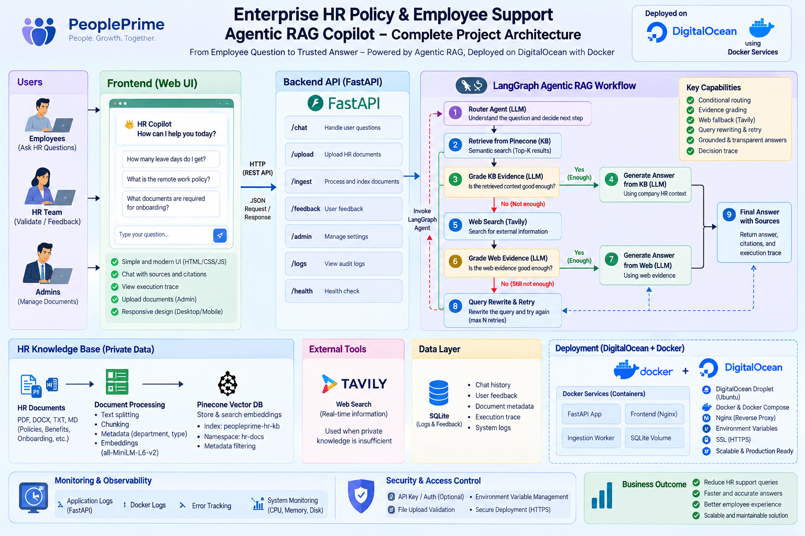
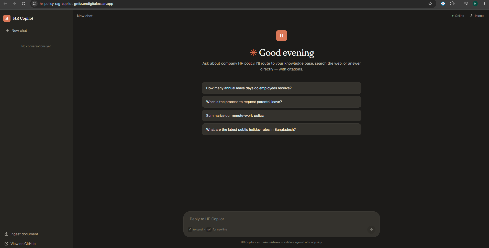

<div align="center">

# HR Policy RAG Copilot

**Agentic RAG assistant for enterprise HR policy questions**

Self-correcting retrieval across a private knowledge base, live web search, and fallback answers — orchestrated by LangGraph.

[](https://hr-policy-rag-copilot-gnfsr.ondigitalocean.app)
[](https://cloud.digitalocean.com/apps)
[](LICENSE)

[**Try the live demo →**](https://hr-policy-rag-copilot-gnfsr.ondigitalocean.app)

<br />



</div>

---

## What it does

Employees ask HR questions in natural language. A LangGraph-orchestrated agent decides — per question — whether to:

- 🟢 **Answer from the private HR knowledge base** (Pinecone vector store of internal policies)
- 🔵 **Fall back to live web search** (Tavily) when the KB has weak evidence
- 🟣 **Reply directly** for casual conversation (greetings, thanks)
- 🟠 **Return a fallback message** when neither source is sufficient

Every response is cited, every reasoning step is visible in the collapsible **agent trace**.

The router LLM classifies each question. KB retrieval is graded by another LLM; if evidence is weak, the graph falls through to web search, which is also graded before answer generation. Query rewriting kicks in when both sources fail. LangSmith traces every node.

## UI preview

<div align="center">



</div>

## Features

| Category | Details |
|---|---|
| **Agentic flow** | Router → KB retrieve → grade → (web fallback → grade) → generate. Self-correcting when evidence is weak. |
| **Multi-source** | Pinecone vector DB (private KB) + Tavily (live web) + fallback answer |
| **Evidence grading** | LLM-as-judge scores retrieved chunks as `good` / `weak` before answer generation |
| **Query rewriting** | If web + KB both fail, the agent rewrites the question and retries |
| **Citations** | Every answer shows numbered source list — internal doc titles or external URLs |
| **Agent trace** | Collapsible timeline shows every LangGraph node fired, color-coded by outcome |
| **Document ingestion** | Admin-gated `/api/ingest` for PDF/DOCX/TXT/MD files, chunked and embedded |
| **Audit log** | SQLite log of every query with source, trace, and timestamp |
| **LangSmith tracing** | Env-toggled, initialized before langchain imports for correct capture |
| **UI** | Anthropic-inspired: warm cream palette, Fraunces serif accents, sidebar with conversation history (localStorage), floating composer, live API status indicator |

## Tech stack

**Backend**
- FastAPI · LangGraph · LangChain · OpenAI (gpt-4o-mini + text-embedding-3-small) · Pinecone · Tavily · SQLite (audit)

**Frontend**
- Next.js 16 (App Router, static export) · React 19 · TypeScript · Tailwind CSS 4 · Sonner · Lucide

**Infrastructure**
- Docker (unified multi-stage image: Node builds → Python serves) · DigitalOcean App Platform (~$5/mo)

## Project structure

```
hr-policy-rag-copilot/
├── backend/                       # FastAPI + LangGraph agent
│   ├── app/
│   │   ├── api/routes.py          # /api/chat, /api/ingest, /api/health
│   │   ├── rag/workflow.py        # LangGraph nodes: router, retrieve, grade, generate
│   │   ├── rag/vectorstore.py     # Pinecone index management + embeddings
│   │   ├── services/audit.py      # SQLite audit log
│   │   ├── core/tracing.py        # LangSmith bootstrap
│   │   └── main.py                # FastAPI app + CORS + static file serving
│   ├── data/sample_kb/            # Sample HR handbook & operations runbook
│   ├── requirements.txt
│   └── .env.example
├── frontend/                      # Next.js UI (static export)
│   ├── src/app/                   # Chat page + layout
│   ├── src/components/            # Sidebar, Composer, Message, TracePanel, AdminDialog
│   ├── src/lib/                   # API client, conversation store, utils
│   └── next.config.ts             # output: 'export'
├── Dockerfile                     # Unified multi-stage build
├── docker-compose.yml             # Local dev (one service)
├── .do/app.yaml                   # DigitalOcean App Platform spec
└── docs/
    ├── architecture.png
    └── screenshots/
```

## Local development

### Prerequisites

- Python 3.13+
- Node 20+
- API keys: [OpenAI](https://platform.openai.com/api-keys), [Pinecone](https://app.pinecone.io/), [Tavily](https://app.tavily.com/)

### 1. Backend

```powershell
cd backend
python -m venv .venv
.venv\Scripts\Activate.ps1
pip install -r requirements.txt

cp .env.example .env
# Edit .env with your API keys

python run.py              # http://localhost:8080
```

### 2. Frontend

```powershell
cd frontend
npm install
echo NEXT_PUBLIC_API_URL=http://localhost:8080 > .env.local
npm run dev                # http://localhost:3000
```

### 3. Seed the knowledge base

```powershell
cd backend
.venv\Scripts\Activate.ps1
python ingest_sample_kb.py
```

Indexes the sample HR handbook and operations runbook into Pinecone.

### Or run everything in one Docker container (matches production)

```powershell
docker compose up --build
# Open http://localhost:8080
```

## Deploy to DigitalOcean

The `.do/app.yaml` defines a **single service** (~$5/mo) that serves the frontend and API from one container.

### Via `doctl` (recommended)

```powershell
winget install DigitalOcean.Doctl
doctl auth init
doctl apps create --spec .do/app.yaml
```

### Via dashboard

1. https://cloud.digitalocean.com/apps → **Create App**
2. Choose GitHub → select this repo → branch `main`
3. Source directory: `/` (root)
4. Instance: `apps-s-1vcpu-0.5gb` (**$5/mo**), 1 container
5. Add env vars — encrypt the 4 API keys:
   - `OPENAI_API_KEY`, `TAVILY_API_KEY`, `PINECONE_API_KEY`, `ADMIN_API_KEY` (SECRET)
   - `PINECONE_INDEX_NAME`, `PINECONE_NAMESPACE`, `OPENAI_MODEL`, `EMBEDDING_MODEL` (plain)
6. Health check path: `/api/health`
7. Create

Build takes ~5-8 min. Public URL: `https://<app-name>-<hash>.ondigitalocean.app`

### Post-deploy: seed the production KB

Open the deployed URL → click **Ingest document** → paste your admin key → upload `backend/data/sample_kb/*.md`.

## API reference

| Method | Path | Auth | Purpose |
|--------|------|------|---------|
| `GET`  | `/api/health` | none | Liveness check |
| `GET`  | `/api/meta` | none | Service info + LangSmith status |
| `POST` | `/api/chat` | none | `{"question": "..."}` → agentic response |
| `POST` | `/api/ingest` | `x-admin-key` header | Upload doc (PDF/DOCX/TXT/MD) |
| `GET`  | `/docs` | none | Swagger UI |

Frontend at `/` and any other path (SPA client-side routing).

## Example queries

**Hits the private KB** (green badge):
- *How many annual leave days do employees receive?*
- *What's the remote-work policy?*
- *How do I request parental leave?*
- *What are the payroll issue priorities?*

**Falls through to web search** (blue badge — KB doesn't cover these):
- *What are the current US federal minimum wage laws?*
- *Latest FMLA updates in 2026?*

**Direct answer** (violet badge — casual):
- *Hi, who are you?*
- *Thanks for your help.*

## Observability

Enable LangSmith tracing to see every node execution, LLM call, and token usage:

```env
LANGSMITH_TRACING=true
LANGSMITH_API_KEY=lsv2_pt_...
LANGSMITH_PROJECT=hr-policy-rag-copilot
```

Traces at https://smith.langchain.com — search by project name.

## License

Apache 2.0 — see [LICENSE](LICENSE)

---

<div align="center">

Built by [Amir Khan](https://github.com/Mkhan2317) · [Report an issue](https://github.com/Mkhan2317/hr-policy-rag-copilot/issues)

</div>
